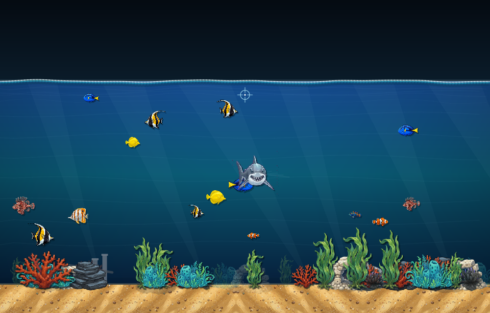

# Kilix Fishtank

Arcade-style virtual fishtank for Kitty graphics protocol terminals,
written in C. The main mode is **Reef Rush**: feed the tank, build combo
chains, trigger frenzy, and keep sharks from breaking the streak.
It uses a software RGBA framebuffer and streams zlib-compressed frames to
the terminal as Kitty image protocol escape sequences. Fish, shark, boat,
sand, rock, plant, and turnaround atlas visuals use embedded image assets.
Every spawnable fish is a real species: ocellaris clownfish, blue tang, yellow
tang, copperband butterflyfish, lionfish, mandarin dragonet, Moorish idol, and
royal angelfish. Fish and sharks use generated bitmap turn atlases for
frame-addressed turnaround animation, plus cached swim frames, staged shark
bite sequences with blood particles, animated attack overlays, and sprite
warping at startup. Sharks can
be added with `S`, and boats can be added with `B`; neither spawns by default.
Sharks can occasionally leave the tank edge and return with fast attack sweeps. The static
water/sand backdrop is cached between world resets, and the water surface
uses a lightweight 1D wave simulation for feeding ripples, boat wake, and
shark disturbances. Fish and sharks ease through edge-on turn poses instead
of snapping direction. Multiple boats fight with arcing cannon shots until one
remains; with exactly one boat, `M` toggles a small fishing mode from that boat.
Interactive runs also start a quiet CC0-derived aquarium ambience loop through
the in-process PCM mixer. Feeding, fish bites, shark bites, frenzy, and landed
catches have event cues from the same local CC0/procedural asset pipeline.



## Build

```sh
make
./kilix-fishtank
```

Linux only. Requires a C compiler, zlib, libm, and pthreads. It works in
Kitty-protocol terminals such as kitty, Ghostty, WezTerm, and kilix.

## Controls

| Key / Mouse | Action |
|-------------|--------|
| Mouse move | aim the visible cursor / fishing hook |
| Click | drop food, or strike/reel while fishing |
| Space / Enter | sprinkle food, or strike/reel while fishing |
| F | add fish |
| S | add shark |
| B | add boat |
| M | toggle fishing mode when exactly one boat is active |
| I | toggle info / score overlay |
| A | toggle quiet water ambience |
| C | clear sharks |
| P | pause |
| H / ? | help overlay |
| R | regenerate tank |
| Q / Esc | quit |

## Development

```sh
make test
./kilix-fishtank --render-test 42
./kilix-fishtank --selftest 1337 7200
./kilix-fishtank --sound-test
```

`--render-test` writes `render_initial.ppm`, `render_attack.ppm`, and
`render_fishtank.ppm` without requiring a terminal.

Generated image data is embedded in `src/embedded_assets.h`, so the raw image
working files are not required to build or run the project.

Framebuffer presentation, common raster primitives, and audio mixing use
vendored `kitty-framebuffer`, `soft-raster`, and `pcm-mixer` sources under
`third_party/`.

Audio assets live under `assets/audio/`. The quiet ambience loop and ten event
cues are PCM WAV files played through the shared mixer; see
[`assets/audio/README.md`](assets/audio/README.md) for sources and licences.
Set `KILIX_FISHTANK_NO_AUDIO=1` to disable startup audio,
`KILIX_FISHTANK_AUDIO_VOLUME=0..100` to adjust playback volume, or
`KILIX_FISHTANK_AUDIO=/path/to/file.wav` to use another mono 44.1 kHz PCM16 loop.
